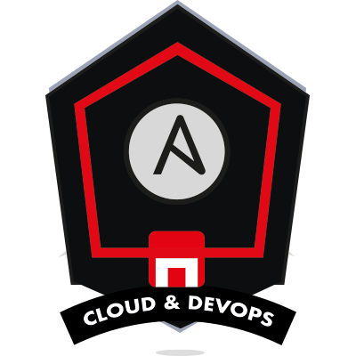
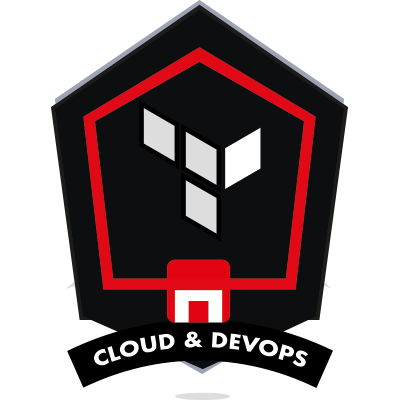
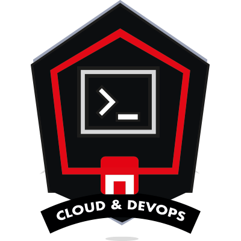
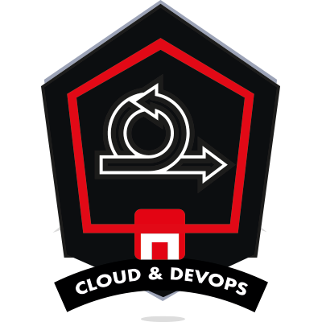

<!--
**juanadevesat/juanadevesat** is a ✨ _special_ ✨ repository because its `README.md` (this file) appears on your GitHub profile.

Here are some ideas to get you started:

- 🔭 I’m currently working on ...
- 🌱 I’m currently learning ...
- 👯 I’m looking to collaborate on ...
- 🤔 I’m looking for help with ...
- 💬 Ask me about ...
- 📫 How to reach me: ...
- 😄 Pronouns: ...
- ⚡ Fun fact: ...
-->

### Hi there 👋

This is my coding playground, where I enjoy learning and exploring different technologies. 

## 🚀 Let's get started! 

This github is a learning and testing space. My public repositories are there to showcase my development in this industry and help potential recruiters get a better picture of my profile as a cloud architect and devops engeneer. Feel free to explore, clone and play around.

## 🛠️ These are the tools in my toolbox:

<!--Badges: https://github.com/Ileriayo/markdown-badges-->

## 📊 My GitHub stats:

 

## ✨ Skills
<table style="border: 0px;">
    <tr>
        <td></td>
        <td></td>
        <td></td>
        <td></td>
    </tr>
    <tr>
        <td></td>
        <td></td>
        <td></td>
        <td></td>
    </tr>
    <tr>
        <td></td>
        <td></td>
        <td></td>
    </tr>
</table>

## Feel free to get in touch:

